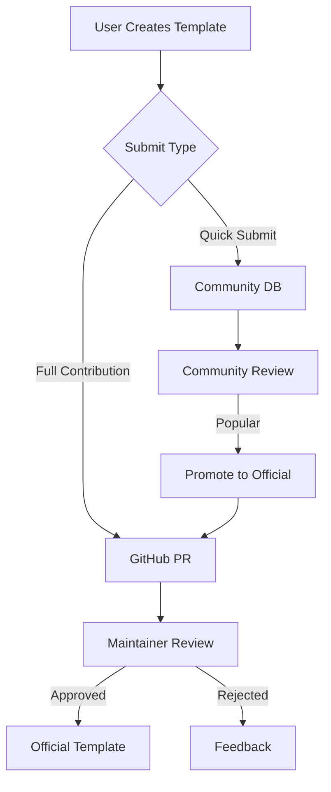

# 🏗️ Architecture Overview

## Data Sources

### 1. Official Templates (Git-based)
- **Location**: `/templates/*.yaml`
- **Process**: PR → Review → Merge
- **Versioning**: Git tags + semantic versioning
- **Status**: `official`

### 2. Community Templates (Database)
- **Storage**: PostgreSQL/Supabase
- **Process**: Submit → Vote → Promote to official
- **Status**: `community`, `experimental`

### 3. User Templates (Local/Cloud)
- **Storage**: Browser localStorage + optional cloud sync
- **Process**: Create → Save → Share
- **Status**: `personal`

## Template Lifecycle



## Version Management

### Official Templates
```yaml
metadata:
  template_version: "1.2.0"  # Semantic versioning
  schema_compatibility: "v1.0"
  changelog:
    - version: "1.2.0"
      date: "2024-11-02"
      changes: ["Added new tool", "Fixed prompt"]
    - version: "1.1.0"
      date: "2024-10-15"
      changes: ["Initial release"]
```

### Database Schema
```sql
CREATE TABLE templates (
  id UUID PRIMARY KEY,
  name VARCHAR(255) NOT NULL,
  slug VARCHAR(255) UNIQUE NOT NULL,
  version VARCHAR(20) NOT NULL,
  status template_status NOT NULL,
  author_id UUID REFERENCES users(id),
  template_data JSONB NOT NULL,
  votes INTEGER DEFAULT 0,
  downloads INTEGER DEFAULT 0,
  created_at TIMESTAMP DEFAULT NOW(),
  updated_at TIMESTAMP DEFAULT NOW()
);

CREATE TABLE template_versions (
  id UUID PRIMARY KEY,
  template_id UUID REFERENCES templates(id),
  version VARCHAR(20) NOT NULL,
  template_data JSONB NOT NULL,
  changelog TEXT,
  created_at TIMESTAMP DEFAULT NOW()
);
```

## Benefits of Hybrid Approach

1. **Git Benefits**: Version control, transparency, community review
2. **Database Benefits**: Dynamic content, user features, analytics
3. **Best of Both**: Official quality + community innovation
